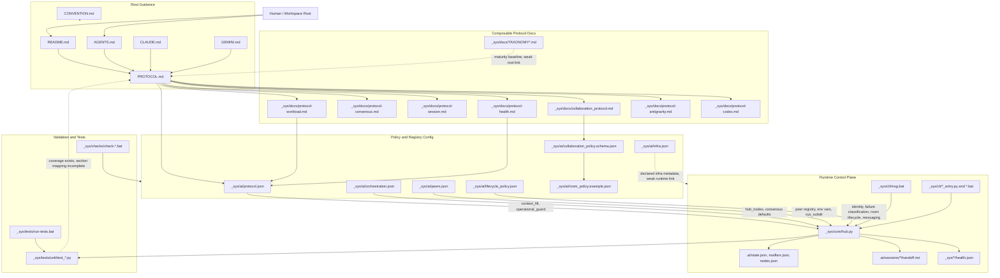
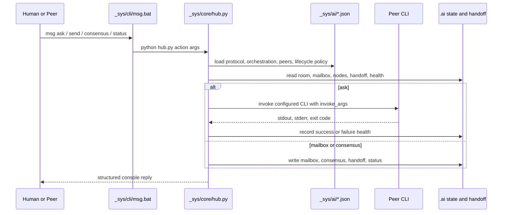

# Workspace Connectivity Map

This document maps how root documents, source code, tests, and JSON configuration connect from the workspace root into the runtime collaboration system.

## Scope

Reviewed with peer input from `gc`, `ca`, and `ag`. `cc` did not return before timeout for this round. The map covers root entry documents, `_sys/ai` policy files, `_sys/core/hub.py`, `_sys/cli` wrappers, tests, checks, and peer-specific configuration.

## System Map



## Runtime Data Flow



## Explicit Traceability

| Source | Runtime target | Status |
|---|---|---|
| `_sys/ai/orchestration.json["hub_nodes"]` | `hub.py:_default_nodes()` and `action_ask()` | Explicit |
| `_sys/ai/orchestration.json["consensus"]` | `hub.py:main()` consensus defaults | Explicit |
| `_sys/ai/peers.json["sys_subdir"]` | `hub.py:_peer_sys_dir()` | Explicit |
| `_sys/ai/peers.json["env_vars"]` | `hub.py:action_ask()` process environment | Explicit |
| `_sys/ai/lifecycle_policy.json["identity.node_to_peer"]` | `hub.py:_node_to_peer_map()` | Explicit |
| `_sys/ai/lifecycle_policy.json["ask_failure_classification"]` | `hub.py:_classify_ask_failure()` | Explicit |
| `_sys/ai/lifecycle_policy.json["room_lifecycle"]` | `hub.py:action_new_topic()` and `action_clear_room()` | Explicit |
| `_sys/ai/lifecycle_policy.json["messaging.send"]` | `hub.py:action_send()` | Explicit |
| `_sys/ai/protocol.json["session.context_fill_sections"]` | `hub.py:action_context_fill()` | Explicit |
| `_sys/ai/protocol.json["operational_guard"]` | `hub.py:_guard_action()`, `action_preflight()`, context ack, error memory | Explicit |
| `_sys/cli/msg.bat` | `hub.py` | Explicit thin wrapper |

## Weak or Implicit Traceability

| Area | Gap | Impact |
|---|---|---|
| `protocol.json["collab_rate"]` | Documented as important, but not fully enforced as a runtime gate for every governed action | Human and peers can overestimate automatic enforcement |
| `protocol.json["_peers_voted"]` vs `orchestration.json["consensus.default_voters"]` | Two voter lists exist; runtime uses orchestration defaults for proposals | Possible drift |
| `lifecycle_policy.json["health_lifecycle.state_actions"]` | State action names are declared but not dispatched generically | Some lifecycle behavior remains implemented ad hoc |
| `lifecycle_policy.json["messaging.broadcast"]` | Some fields are policy documentation rather than fully consumed runtime settings | Broadcast behavior can appear more configurable than it is |
| `hub_config.json` | `hub.py` looks for `_sys/core/hub_config.json`, but only defaults are guaranteed | Silent fallback hides tuning surface |
| Test mapping | Tests exist, but protocol sections do not map one-to-one to test files | Harder audit trail for protocol changes |
| Taxonomy docs | `_sys/docs/TAXONOMY*.md` are not strongly linked from root docs | Maturity baseline is discoverable but not central |
| Root temporary files | Many short random-name root files exist | Workspace hygiene and output-routing issue |

## Peer Model Designation

Current state:

- `msg ask --to <node>` selects a peer node, not a model.
- `hub.py:action_ask()` reads the selected node from `.ai/nodes.json` merged with `_sys/ai/orchestration.json`.
- The executable and arguments come from `invoke` and `invoke_args`.
- There is no generic runtime `--model` option on `msg ask`.

Supported config-only pattern:

```json
{
  "node_id": "gc-pro",
  "aliases": ["gemini-pro"],
  "type": "peer",
  "invoke": "gemini",
  "invoke_args": ["-m", "MODEL_NAME", "-p", "{query}", "-o", "text", "-y"],
  "memory": "session",
  "timeout": 0
}
```

Callers can then use:

```bat
_sys\cli\msg.bat ask --to gc-pro --query "..."
```

This is the lowest-risk approach because it uses the existing registry and does not add command-line model parsing rules. A future enhancement can add a `model_profiles` section to `orchestration.json` and a validated `--model-profile` argument, but that should be gated by `operational_guard` and tests.

## Collaboration Improvement Observed in This Task

| Dimension | Before recent guard work | This task |
|---|---|---|
| Shell mistakes | Repeated wrong-shell commands could recur without memory | Preflight policy exists and wrong-shell risks were explicitly considered |
| Peer health | Failures were discussed manually | Peer asks route through health-aware hub behavior |
| Output routing | Large analysis could spill into console | Requested artifact was written to this file |
| Division of labor | Informal peer consultation | `gc` handled diagram draft, `ag` handled model-routing path, `ca` audited traceability |
| Consensus confidence | Hard to tell who reviewed what | Peer responses were role-specific and cross-checked |
| Token efficiency | Same repository facts could be re-sent repeatedly | Local `rg`/file reads supplied facts; peer prompts were narrow |

## Recommended Improvements

1. Add a first-class `traceability_map.json` that maps each protocol section to config keys, runtime functions, and tests.
2. Resolve voter-list drift by making either `_sys/ai/protocol.json["consensus.r10_voters"]` or `_sys/ai/orchestration.json["consensus.default_voters"]` canonical.
3. Clarify `collab_rate` as either a fully enforced runtime gate or a human/peer governance policy with partial runtime support.
4. Add `_sys/core/hub_config.json.example`, or move hub limits into `protocol.json` or `lifecycle_policy.json`.
5. Add a `model_profiles` or virtual-node convention to `orchestration.json` so model-specific peers are explicit and reviewable.
6. Route peer-created long analysis artifacts into workspace paths, not external brain/cache paths.
7. Add cleanup rules for random short files in the root, after confirming their producer.
8. Add a quiet P2P mode for wrappers so status/context-fill output does not pollute programmatic ask responses.
